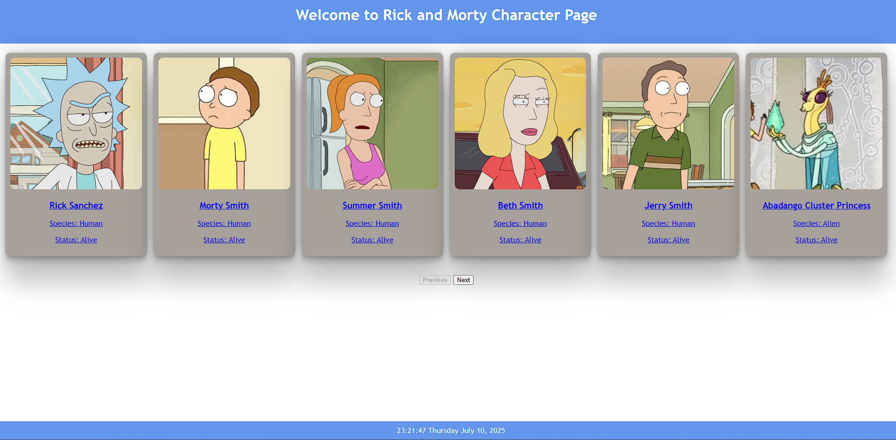

# Rick and Morty Wiki App

Its a simple and responsive web app created by using HTML, CSS, and JavaScript that shows characters from the Rick and Morty universe by using 
the Rick and Morty API > (https://rickandmortyapi.com/).

# What's inside this app (Features)
1. You can view characters in the paginated grid layout
2. For detailed information click on the characters to see the content of specific characters.
3. Added a live clock which updates every seconnds

# Deployed Link

https://superlative-heliotrope-d467cf.netlify.app/

#ScreenShot

#Challenges I faced

1. It is first time I deployed any website so it was little time taking.